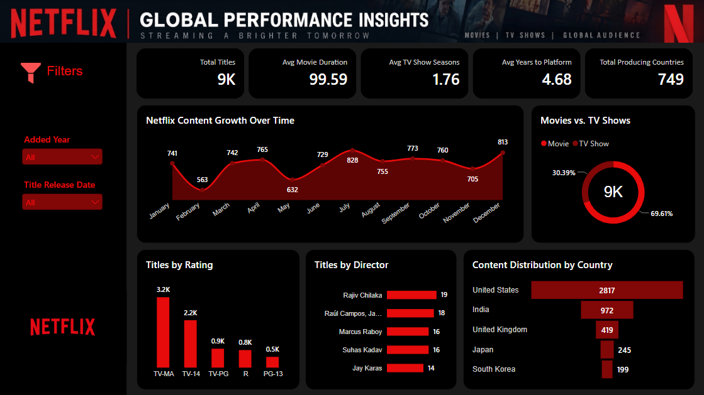

# 🎬 Netflix Content Analytics Dashboard

A comprehensive data analytics solution designed to explore Netflix's catalog, uncovering trends in content release years, maturity ratings, geographic distribution, and genre preferences.

---

## 📊 Project Overview
This project transforms raw catalog data into actionable insights, helping stakeholders track movie versus TV show ratios, top-producing countries, and content expansion timelines over the years.

---

## 🚀 Key Features & KPIs
- **Content Volume:** Thousands of titles cataloged across global production hubs.
- **Format Breakdown:** Clear comparative analysis between Movies and TV Shows.
- **Temporal Trends:** Year-over-year content addition tracking and peak release timelines.
- **Interactive Filtering:** Slicers for release years, maturity ratings (e.g., TV-MA, PG-13), genres, and primary countries.

---

## 📈 Dashboard Preview

---

## 🛠️ Tools & Technologies
- **Tool:** Microsoft Power BI / Tableau / Python (update based on your stack)
- **Data Prep:** Power Query, DAX / Python Pandas for data cleaning and calculated measures.
- **UI Design:** Professional dark mode interface optimized for entertainment data exploration.

---

## 💡 Key Insights
- **Content Dominance:** Movies significantly outnumber TV shows, making up the vast majority of the overall platform catalog.
- **Growth Surge:** Content library expansions saw an aggressive upward trajectory starting around 2016, aligning with global streaming shifts.
- **Geographic Reach:** The United States and India lead globally as the top two content-producing countries by a wide margin.
